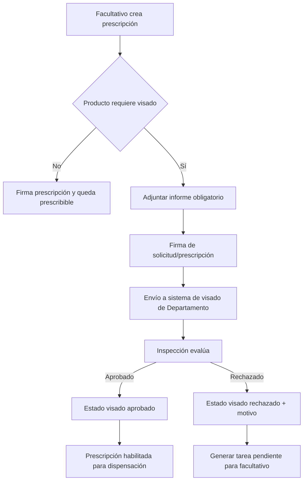

# Proyecto Prescripciones Ortoprotésicas Osakidetza

## Enfoque PM-BA del bloque crítico: Integraciones y Visado

Fecha de elaboración: 04/03/2026  
Estado: Borrador para validación funcional y técnica

---

## 1) Objetivo del bloque

Definir y cerrar, con criterio de Administración Pública (trazabilidad, interoperabilidad y seguridad jurídica), el diseño operativo de:

- Integraciones entre sistemas clínicos, catálogo, inspección y dispensación.
- Flujo completo de visado de productos ortoprotésicos.
- Reglas de estado y eventos de negocio asociados.

Este bloque condiciona el resto del proyecto (prescripción, tareas, reporting y explotación analítica).

---

## 2) Alcance funcional del bloque

Incluye:

- Inicio de prescripción desde entorno clínico.
- Consulta y uso del nomenclátor de productos.
- Firma de prescripción.
- Solicitud y resolución de visado por inspección del Departamento.
- Recepción de estados de visado y actualización de la prescripción.
- Exposición/consumo de información de dispensación.

No incluye (en esta fase de definición):

- Diseño visual detallado de pantallas.
- Definición exhaustiva de cuadros de mando y KPIs analíticos.
- Desarrollo de módulos no dependientes de integraciones (por ejemplo, mejoras cosméticas de UX).

---

## 3) Mapa de integraciones (propuesta inicial)

| ID | Sistema origen | Sistema destino | Tipo | Datos principales | Propósito | Estado |
|---|---|---|---|---|---|---|
| INT-01 | Osabide Global / eOsabide | Módulo Prescripción Ortoprotésica | Token + contexto de sesión | Profesional, centro, ámbito, permisos base | Inicio seguro y contextualizado de prescripción | Pendiente validar contrato |
| INT-02 | Módulo Prescripción | Nomenclátor (Depto / réplica Osakidetza) | Consulta API / sincronización | Catálogo, familias, códigos, flags de visado, financiaciones | Selección de productos y validaciones de negocio | Pendiente validar gobierno de datos |
| INT-03 | Módulo Prescripción | Servicio de Firma (Giltza/Izenpe) | Servicio firma | Documento de prescripción/informe, metadatos de firmante | Autorización clínica formal de prescripción | Pendiente validar flujo de firma |
| INT-04 | Módulo Prescripción | App/Servicio de Visado de Departamento | API evento/solicitud | Prescripción, informe adjunto, datos paciente/profesional, producto(s) | Solicitar visado cuando proceda | Crítico pendiente |
| INT-05 | Servicio de Visado de Departamento | Módulo Prescripción | API callback/polling | Estado de visado, motivo rechazo, fecha resolución | Actualizar estado clínico-administrativo | Crítico pendiente |
| INT-06 | Ortopedias / Sistema dispensación | Módulo Prescripción | API interoperabilidad | Estado dispensación, fecha, establecimiento, importes | Cerrar ciclo asistencial y administrativo | Pendiente validar canal |
| INT-07 | Módulo Prescripción | SOA/otros módulos Osakidetza | API interna | Prescripciones por paciente/TIS, estados | Consumo transversal y continuidad asistencial | En estimación técnica |
| INT-08 | Módulo Prescripción | BBDD/Plataforma Reporting | ETL | Hechos de prescripción, visado, dispensación, tiempos | Explotación y seguimiento operativo | En estimación técnica |

### Principios de integración recomendados

- API-first con contratos versionados y trazabilidad de auditoría.
- Evitar acoplamiento a BBDD directa salvo justificación expresa y aprobada.
- Diseñar idempotencia y reintentos para eventos de estado (visado/dispensación).
- Mantener catálogo operativo 24x7 con estrategia de contingencia.

---

## 4) Flujo objetivo de visado (propuesta)

### Reglas mínimas del flujo

1. Si un producto está marcado como Requiere Visado en nomenclátor, el informe es obligatorio.
2. No debe permitirse estado prescribible/dispensable si el visado está pendiente o rechazado.
3. Todo cambio de estado de visado debe dejar traza de auditoría.
4. Rechazo de visado debe generar tarea accionable con motivo y fecha.
5. El sistema debe permitir reintento de solicitud tras subsanación documental.

---

## 5) Modelo de estados recomendado (prescripción y visado)

### 5.1 Prescripción

- Borrador
- Firmada
- Pendiente de visado
- Visada aprobada
- Visada rechazada
- Dispensable
- Dispensada
- Anulada

### 5.2 Visado

- No aplica
- Pendiente envío
- Enviado
- En evaluación
- Aprobado
- Rechazado
- Cancelado

### 5.3 Eventos clave

- Prescripción creada
- Prescripción firmada
- Visado solicitado
- Visado aprobado
- Visado rechazado
- Dispensación informada
- Prescripción anulada

---

## 6) Riesgos críticos y mitigación

| Riesgo | Impacto | Mitigación propuesta |
|---|---|---|
| Contratos de integración sin cerrar (visado/dispensación) | Alto | Taller técnico-funcional con responsables de cada sistema y definición de API/campos/estados |
| Gobernanza incompleta del nomenclátor | Alto | Matriz RACI de propiedad de campos, periodicidad de sincronización y reglas de fallback |
| Ambigüedad en granularidad prescripción/receta/producto | Alto | Decisión funcional formal y adaptación de modelo de datos antes de desarrollo masivo |
| Gestión de errores entre sistemas sin protocolo | Medio-Alto | Catálogo de errores, reintentos controlados e identificación de eventos idempotentes |
| Riesgo de bloqueo clínico por caída catálogo principal | Alto | Réplica operativa con monitorización y procedimientos de conmutación definidos |

---

## 7) Decisiones a cerrar (gates de proyecto)

1. Canal definitivo para INT-04 e INT-05 (solicitud y respuesta de visado): push/callback, polling o mixto.
2. Contrato oficial de estados de visado y prescripción (nombres, transiciones, códigos de error).
3. Sistema autoritativo para persistencia de prescripción (servicio intermedio vs almacenamiento directo).
4. Alcance exacto de edición Osakidetza sobre nomenclátor y proceso de sincronización bidireccional (si aplica).
5. Especificación legal/operativa del documento PDF oficial y firma.

---

## 8) Preguntas de validación para cerrar este bloque

1. ¿El sistema de visado del Departamento expone API de entrada/salida o requiere integración por mecanismo alternativo?
2. ¿La devolución de estado de visado será síncrona o asíncrona? En asíncrono, ¿qué SLA se espera?
3. ¿La unidad funcional a bloquear/desbloquear en dispensación es receta individual o cabecera de prescripción?
4. ¿Qué campos del nomenclátor puede editar Osakidetza y con qué trazabilidad/aprobación?
5. ¿Cuál es el repositorio oficial del PDF firmado (y su política de conservación)?
6. ¿Existe catálogo corporativo de códigos de error/causa para visado rechazado?

---

## 9) Siguiente paso propuesto

Una vez validadas las preguntas anteriores, se elaborará en la siguiente iteración:

- Épicas cerradas por bloque funcional/técnico.
- Tareas detalladas por equipo (funcional, backend, frontend, integración, QA, datos).
- Dependencias y secuenciación para planificación ejecutable.
