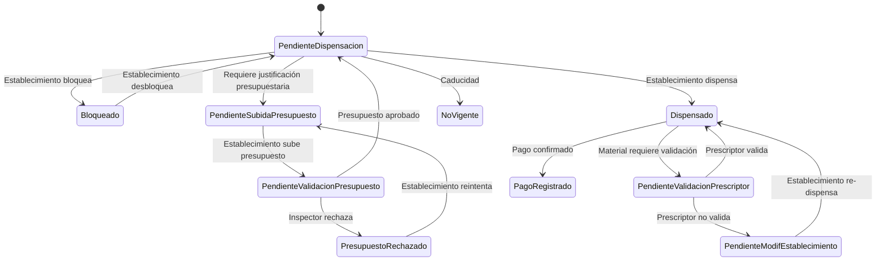
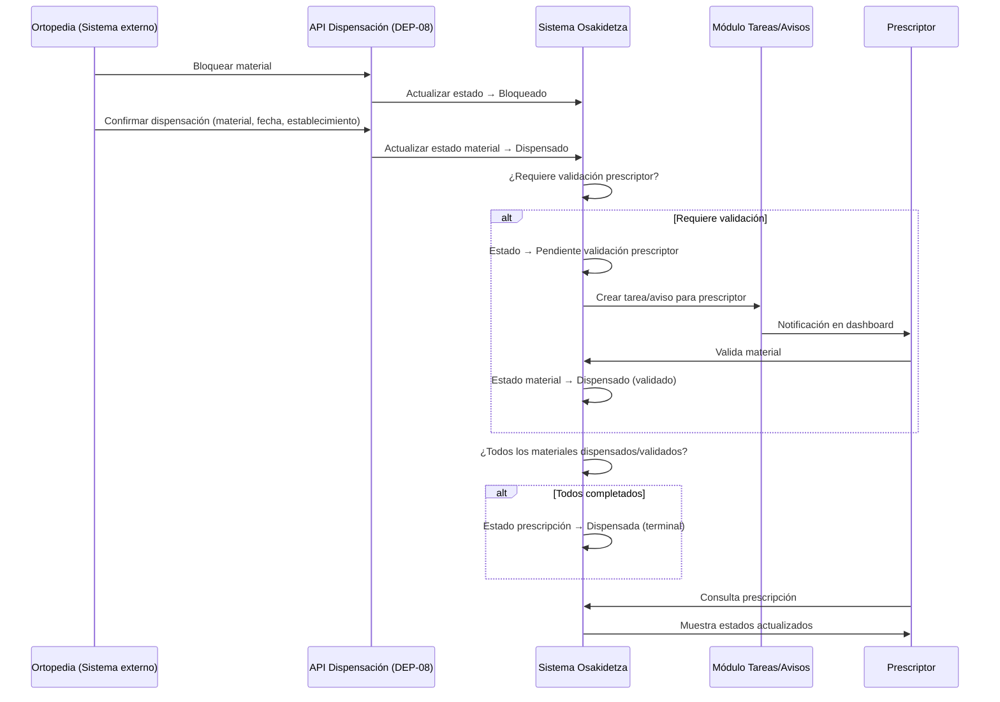
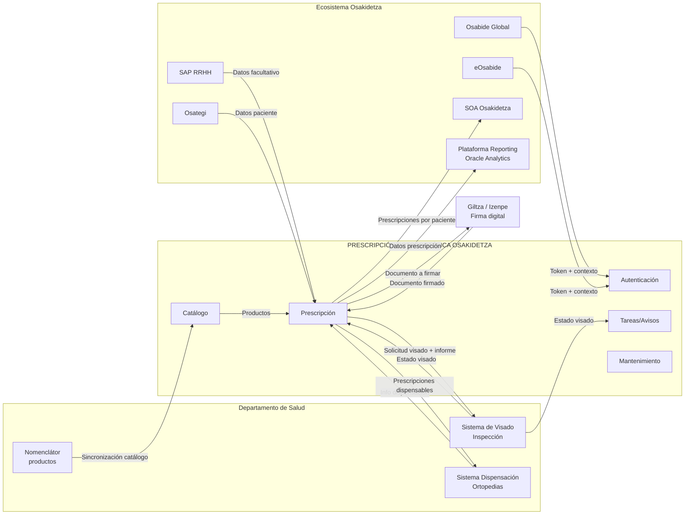

# Proyecto Prescripciones Ortoprotésicas — Osakidetza

## Enfoque PM/BA V4: Módulos, Dependencias y Verificación

Fecha de elaboración: 04/03/2026  
Estado: **Borrador V4** — alcance acotado a Osakidetza  
Fuentes primarias: **Notas de reuniones**, **Dudas y preguntas (internas y externas)**, **Sección Prescripciones de GELPO (Aragón)**  
Fuente secundaria (a verificar): Excel de estimación de tareas

> **Nota metodológica**: Este enfoque se construye íntegramente desde el contexto de proyecto (reuniones, dudas resueltas, referencia GELPO §5 Prescripciones). El Excel de estimación se trata como hipótesis a contrastar, no como fuente de verdad. La sección 6 de este documento cruza lo derivado del contexto contra el Excel para identificar qué falta y qué sobra.

---

## 1. Alcance del proyecto

### 1.1 Qué INCLUYE (derivado de notas de reuniones y dudas resueltas)

El sistema de **Prescripción Ortoprotésica de Osakidetza** cubre la funcionalidad para que los profesionales de Osakidetza prescriban, gestionen y den seguimiento a prescripciones ortoprotésicas.

**Origen**: notas de reuniones — *"Osaki requiere una solución para la prescripción de estos productos por parte del facultativo"*; *"Los médicos quieren una interfaz de búsqueda de la base de datos que sea lo más completa y accesible posible"*.

En concreto:

- **Prescripción completa**: crear, editar, eliminar, copiar, anular, renovar, firmar, imprimir, descargar informe, exportar Excel.
- **Listado y búsqueda de prescripciones**: por facultativo, todas, con filtros avanzados.
- **Detalle de prescripción**: vista completa con datos de facultativo, paciente, materiales, estados, histórico.
- **Catálogo de productos**: consulta, búsqueda ágil con filtrado por parámetros, gestión de favoritos por servicio/facultativo, carga/sincronización del nomenclátor.
- **Mantenimiento**: gestión de roles, establecimientos, material ortoprotésico (activar/desactivar, campos propios Osakidetza).
- **Tareas pendientes y avisos**: prescripciones pendientes de modificación, visados pendientes/rechazados, **dispensaciones pendientes de validación, notificación de cierre de ciclo asistencial**.
- **Interoperabilidad**: APIs para dispensación (consulta, bloqueo, desbloqueo, recepción), recepción de estado de visado del Departamento, exposición de datos a otros módulos Osakidetza.
- **Cierre del ciclo asistencial**: recepción del dato de dispensación desde la ortopedia, actualización automática de estados, visibilidad del estado de entrega para el prescriptor.
- **Doble acceso**: vía Osabide Global (token) y login externo directo.
- **Transversales**: multi-idioma (euskera/castellano), QA, ETL a reporting.

### 1.2 Qué QUEDA FUERA

Todo lo que es competencia del **Departamento de Salud** o de las **ortopedias como operadores**:

| Excluido | Motivo |
|---|---|
| Pantallas de visado/inspección (acciones del inspector: aceptar, rechazar, solicitar modificación) | Competencia del Departamento; nuestro sistema solo envía la solicitud y recibe la respuesta |
| Reintegro de gastos, abono directo, fichero multiterceros | Competencia del Departamento |
| Pantallas de dispensación para ortopedias | Las ortopedias usan su propio sistema; nosotros exponemos APIs |
| Chat prescriptor-establecimiento | Fuera de alcance |

> Osakidetza **se integra** con estos sistemas mediante APIs, pero **no los implementa**.

---

## 2. Modelo de acceso (doble vía)

**Origen**: Notas de reuniones — *"Desde Osabide accede a los distintos módulos"*; Dudas externas P7 — *"En principio, siempre accede desde Osabide Global [...] Si estáis preguntando si se quiere una url-web para acceso por DNI-LDAP, no estaba en lo solicitado, pero para pruebas podría ser recomendable"*.

### 2.1 Acceso vía Osabide Global (principal)

| Aspecto | Detalle | Origen |
|---|---|---|
| Canal | El facultativo accede desde Osabide Global (cliente-servidor) | Notas reuniones |
| Mecanismo | Token de sesión con contexto: profesional, centro, ámbito, servicio, permisos | Notas + Dudas ext. P7 |
| Datos precargados | Identificación facultativo, hospital, especialidad, paciente seleccionado | Notas reuniones |

### 2.2 Acceso externo directo (secundario)

| Aspecto | Detalle | Origen |
|---|---|---|
| Canal | URL web directa (pruebas, perfiles no-Osabide, situaciones excepcionales) | Dudas ext. P7 |
| Mecanismo | Login con credenciales LDAP/AD corporativo | Referencia GELPO (GUIA/Cl@ve) |
| Datos precargados | Se recuperan del directorio corporativo y roles del sistema | Inferido del modelo Aragón |

---

## 3. Módulos del sistema

Derivados del análisis funcional cruzando: notas de reuniones, dudas internas/externas resueltas, y sección de Prescripciones de GELPO §5 como referencia de pantallas y flujos.

---

### MÓDULO 1 — AUTENTICACIÓN Y AUTORIZACIÓN

**Origen**: Notas — *"Al entrar, el sistema reconoce quién es el médico, en qué hospital está, en qué servicio..."*; *"La asignación del rol y permisos se realizará desde el módulo de Seguridad y Accesos de eOsabide"*; GELPO §3-§4.1.

| Funcionalidad | Descripción | Origen |
|---|---|---|
| Login desde Osabide Global | Recepción de token, validación de contexto profesional, carga de permisos | Notas reuniones + Dudas P7 |
| Login externo | Pantalla de login + backend de autenticación directa | Dudas ext. P7 |
| Gestión de roles | CRUD de roles con permisos por módulo (consulta, edición, prescripción, administración) | Notas — *"Medico, Consulta, Autorizaciones..."* + GELPO §4.1 |
| Cambio de rol en sesión | Si un usuario tiene varios roles, puede cambiar de rol activo | GELPO §3 |
| Pantalla inicio + avisos | Dashboard con alertas por perfil: prescripciones pendientes de modificación, visados pendientes/rechazados | GELPO §3 avisos |

---

### MÓDULO 2 — CATÁLOGO / NOMENCLÁTOR DE PRODUCTOS

**Origen**: Notas — *"Base de datos de productos: donde el médico ve qué productos puede recetar"*; *"Los médicos quieren una interfaz de búsqueda lo más completa y accesible posible"*; Dudas internas P17 — *"filtrado por parámetros de catálogo"*; Notas — *"Desde Osaki se quiere poder generar Favoritos por servicio o por facultativo"*; *"Creación de un Nomenclátor maestro [...] frecuencia de actualización mensual"*.

| Funcionalidad | Descripción | Origen |
|---|---|---|
| Diseño BBDD catálogo | Modelo de datos: campos del nomenclátor Depto + campos propios Osakidetza | Notas — *"El catálogo enviado a Osaki contendrá toda la info, que luego podrá discriminar"* |
| Carga masiva (batch) | Proceso periódico de sincronización desde nomenclátor Departamento (mensual inicialmente) | Notas — *"carga mensual a las tablas de Osaki"* |
| Carga bajo demanda | Ejecución manual del mismo proceso para actualización fuera de ciclo | Inferido de necesidad operativa |
| Réplica operativa 24x7 | Copia local para garantizar disponibilidad si cae el nomenclátor principal | Dudas ext. P10/P12 — *"El Nomenclator tiene que ser accesible 24x7 en Osakidetza"* |
| Pantalla gestión catálogo | Listado con filtros + ficha de producto editable (campos Osakidetza) + activar/desactivar | GELPO §4.3 + Notas — *"Osaki puede tocar ciertos campos, aún pendiente de definir"* |
| Búsqueda ágil de productos | Filtros por tipo, familia (grupo>subgrupo>categoría), código, descripción; accesible desde prescripción | Notas — *"búsqueda ágil"* + Dudas P17 |
| Selección de productos | Pantalla de selección dentro de prescripción: favoritos primero + productos similares | GELPO §5.1 + Notas — *"Favoritos"* |
| Gestión de favoritos | Favoritos fijos y dinámicos por facultativo y por servicio | Notas — *"generar Favoritos por servicio o por facultativo"* |
| Gobierno de edición | Definir qué campos puede modificar Osakidetza y trazabilidad de cambios | Dudas ext. P10/P13 — *"aún pendiente de definir"* |

---

### MÓDULO 3 — PRESCRIPCIÓN ORTOPROTÉSICA (núcleo)

**Origen principal**: GELPO §5 (Prescripciones) como referencia directa de pantallas y comportamiento. Adaptado al contexto de Osakidetza según notas y dudas resueltas.

#### 3.1 Pantalla de listado de prescripciones

**Origen**: GELPO §5 listado — *"un listado con todas las prescripciones ortoprotésicas, disponiendo de un filtro para poder acotar el resultado de búsqueda"*.

La pantalla principal muestra un listado con **todas las prescripciones** con posibilidad de filtrar:

| Filtro | Tipo | Origen |
|---|---|---|
| Por facultativo (mis prescripciones / todas) | Selector | GELPO §5 + requisito explícito |
| Por paciente (TIS/CIP, nombre) | Búsqueda | GELPO §5 + Notas |
| Por estado de prescripción | Desplegable multi-selección | GELPO §5 estados |
| Por fecha (desde/hasta) | Rango de fechas | GELPO §5 filtros |
| Por OSI / Localización | Desplegable | Notas — *"filtrados por OSI, Localización, Fechas, tratamiento"* |
| Por tratamiento / tipo producto | Desplegable | Notas — *"filtrados[...] tratamiento"* |

**Acciones desde el listado**:

| Acción | Descripción | Origen |
|---|---|---|
| Crear (Añadir) | Abre formulario de nueva prescripción | GELPO §5 "Añadir" |
| Editar | Abre prescripción existente para modificación (si estado lo permite) | GELPO §5 + requisito explícito |
| Copiar (Duplicar) | Clona prescripción existente como nueva; elimina materiales no válidos para la especialidad del prescriptor | GELPO §5 "Duplicar" |
| Eliminar | Elimina una prescripción en borrador/pendiente firma | Requisito explícito |
| Anular | Anula la prescripción (si no dispensada ni anulada ya) | GELPO §5 "Anular" |
| Renovar | Crea prescripción de renovación; si es temprana, exige justificación clínica | GELPO §5 renovación |
| Descargar informe | Genera y descarga el informe/CSV de la prescripción firmada | GELPO §5 "Descargar informe" |
| Imprimir prescripción | Genera PDF oficial para entrega al paciente | Notas — *"se pueda imprimir siempre el PDF del informe de Prescripción para que el paciente pueda entregarlo en la Ortopedia"*; GELPO §5 |
| Generar Excel | Exporta listado filtrado a fichero Excel | GELPO §5 "Generar Excel" |
| Consultar detalle | Accede a la ficha completa de la prescripción (clic en Nº Expediente) | GELPO §5 consulta |

#### 3.2 Pantalla de creación/edición de prescripción

**Origen**: GELPO §5.1 formulario de creación, adaptado al contexto Osakidetza.

**Bloque Datos del paciente** (precargados):
- Nombre, apellidos, TIS/CIP, sexo, fecha nacimiento, domicilio
- **Origen**: GELPO §5.1 — *"Al seleccionar un paciente y pulsar Guardar, sus datos son trasladados"*; Dudas ext. P11 — datos extraídos de Osategi/eOsabide

**Bloque Datos del facultativo** (precargados):
- Nombre, apellidos, nº colegiado, especialidad, centro, servicio
- **Origen**: GELPO §5.1 — *"Se recogerá de forma automática los datos de la persona que esté logueada"*; Notas — *"vamos a necesitar datos del SAP de RRHH para identificar a este facultativo"*

**Bloque Datos de la prescripción**:
- Nº Expediente (generado automáticamente)
- Diagnóstico y justificación anatómico-funcional (texto libre, obligatorio)
- Motivo de prescripción (enfermedad común, accidente no laboral, accidente trabajo, enfermedad profesional)
- Observaciones (texto libre, opcional)
- Justificación de renovación (obligatorio si renovación temprana)
- **Origen**: GELPO §5.1 campos del formulario

**Tabla de materiales prescritos**:
- Cada fila: Código producto, Descripción, Renovación (sí/no), Requiere visado, Protocolo, Estado material
- Acciones: Añadir (→ pantalla de búsqueda/selección de catálogo), Eliminar, Formulario detalle material
- Si requiere visado → obligar adjuntar informe clínico
- Si tiene protocolo → mostrar campos adicionales del protocolo
- Cada prescriptor solo puede prescribir productos de su unidad clínica; el administrador puede prescribir todo
- **Origen**: GELPO §5.1 — *"Los productos para prescribir serán únicamente aquellos que figuren dentro del catálogo"*; *"Cada prescriptor podrá prescribir productos relacionados con su unidad clínica"*; Notas — *"las condiciones vienen del nomenclátor"*

**Acciones del formulario**:
- Guardar (borrador)
- Guardar y firmar → firma digital (Giltza) → genera CSV/documento firmado
- Descargar CSV (una vez firmada)
- **Origen**: GELPO §5.1 — *"Guardar y firmar"*; Notas — firma Giltza/Izenpe

#### 3.3 Pantalla de detalle/consulta de prescripción

Vista en modo lectura con todos los datos de la prescripción. Incluye:
- Histórico de la prescripción (acciones realizadas, cambios de estado, fechas)
- Documentos adjuntos (informe clínico, CSV firmado)
- Estado actual de cada material
- **Origen**: GELPO §5 — *"Histórico de la prescripción [...] consultar las acciones realizadas"*

#### 3.4 Estados de la prescripción

**Origen**: GELPO §5 estados + requisito explícito del usuario.

| Estado | Descripción | Transiciones posibles |
|---|---|---|
| **Pendiente de firma** | Creada/editada, pendiente de firmar por el prescriptor | → Pendiente inspección / Pendiente dispensación (al firmar) / Anulada |
| **Pendiente inspección** | Firmada; contiene material que requiere visado, renovación temprana, protocolo, o motivo accidente/enf. profesional | → Rechazada / Pendiente modificación / Pendiente dispensación |
| **Rechazada** | Rechazada por inspección; no se puede reabrir, hay que crear nueva | Estado terminal |
| **Pendiente modificación** | Inspector solicita cambios al prescriptor; la prescripción queda bloqueada para otros | → Pendiente inspección (al refirmar) |
| **Pendiente de dispensación** | Válida para dispensar en establecimiento | → Dispensada / No vigente / Anulada |
| **Dispensada** | Todos los materiales dispensados y validados | Estado terminal |
| **No vigente** | No dispensada en plazo configurado → caducada automáticamente | Estado terminal |
| **Anulada** | Cancelada manualmente por el prescriptor | Estado terminal |

#### 3.5 Estados de los materiales

**Origen**: GELPO §5 estados de material + requisito explícito del usuario.

| Estado material | Descripción | Origen |
|---|---|---|
| **Pendiente de dispensación** | Listo para ser dispensado por un establecimiento | GELPO §5 |
| **Bloqueado** | Reservado por un establecimiento; ningún otro puede dispensarlo | GELPO §5 — *"bloquear el material, impidiendo que sea dispensado por otros establecimientos"* |
| **Dispensado** | El establecimiento ha confirmado la dispensación | GELPO §5 |
| **Pendiente validación prescriptor** | Dispensado pero requiere validación clínica del prescriptor (plazo configurable) | GELPO §5 — *"quedará pendiente de validación por el prescriptor"* |
| **Pendiente modificación establecimiento** | El prescriptor no validó; la ortopedia debe ajustar el material | GELPO §5 — *"el paciente debe volver a la ortopedia"* |
| **Pago registrado** | Se ha registrado el pago/abono asociado al material | GELPO §5 |
| **No vigente** | Material caducado por no haberse dispensado en plazo | GELPO §5 — *"6 meses no se dispensa"* |
| **Pendiente subida presupuesto** | Material que requiere justificación presupuestaria por parte del establecimiento | GELPO §5 — *"subir documentación [...] para que Inspección compruebe"* |
| **Pendiente validación presupuesto** | Presupuesto subido; pendiente de aprobación por inspección | GELPO §5 |
| **Presupuesto rechazado** | Presupuesto rechazado; el establecimiento debe volver a subirlo | GELPO §5 |

#### 3.6 Diagrama de estados de prescripción

#### 3.7 Diagrama de estados de material

---

#### 3.8 Verificación contra la Prescripción Modelo de Aragón

**Origen**: Documento PDF firmado digitalmente *Prescripcion_COD_CSVAS001VR2K0150GELP.pdf* — prescripción real emitida desde GELPO (Aragón), con CSV verificable. Este documento es la referencia visual del resultado final que debe producir el sistema de Osakidetza.

El PDF de prescripción modelo de Aragón contiene los siguientes bloques, todos cubiertos en el enfoque:

| Bloque del PDF modelo | ¿Cubierto en este enfoque? | Dónde se cubre |
|---|---|---|
| **Cabecera institucional**: logotipo, título "Prescripción Ortoprotésica", Nº Expediente | **Sí** | §3.2 — Nº Expediente generado automáticamente; la cabecera institucional se define en la plantilla PDF de Osakidetza |
| **Datos del paciente**: nombre, apellidos, CIP/TIS, fecha de nacimiento, sexo, domicilio | **Sí** | §3.2 — Bloque "Datos del paciente", precargados desde Osategi (DEP-03) |
| **Datos del facultativo prescriptor**: nombre, apellidos, nº colegiado, especialidad, centro, servicio | **Sí** | §3.2 — Bloque "Datos del facultativo", precargados desde SAP RRHH (DEP-04) o token Osabide |
| **Motivo de prescripción**: enfermedad común, accidente no laboral, accidente de trabajo, enfermedad profesional | **Sí** | §3.2 — Campo "Motivo de prescripción" con 4 opciones; regla RN-04 para motivos especiales |
| **Diagnóstico y justificación anatómico-funcional** | **Sí** | §3.2 — Campo texto libre obligatorio |
| **Tabla de materiales prescritos**: código, descripción, tipo de producto, indicador de visado, protocolo asociado | **Sí** | §3.2 — "Tabla de materiales prescritos" con columnas código, descripción, renovación, visado, protocolo, estado |
| **Observaciones clínicas** | **Sí** | §3.2 — Campo texto libre opcional |
| **Firma digital con CSV** (Código Seguro de Verificación) | **Sí** | §3.2 — Acción "Guardar y firmar" con integración Giltza/Izenpe (DEP-06); el CSV se genera y se embebe en el PDF |
| **Fecha y hora de emisión** | **Sí** | Implícito en el proceso de firma digital |
| **Generación del documento PDF imprimible** para entrega al paciente | **Sí** | §3.1 — Acción "Imprimir prescripción"; regla RN-11 — *"el PDF debe poder imprimirse siempre"* |

> **Conclusión**: El proceso de creación de prescripción descrito en el Módulo 3 (§3.1–§3.2) produce un documento equivalente al PDF modelo de Aragón. La plantilla visual (logotipo, maquetación, pie de firma) deberá adaptarse a la identidad institucional de Osakidetza, pero todos los bloques de datos están cubiertos.

> **Acción pendiente**: Definir con Osakidetza la plantilla PDF oficial (logotipo, formato, disposición de campos, texto legal) para que el sistema genere documentos con la imagen corporativa correcta.

#### 3.9 Flujo de cierre del ciclo asistencial (dispensación → visibilidad médico)

**Origen**: GELPO §5 (estados de material y prescripción), DEP-08 (Sistema Dispensación), Notas — *"Se notifica a Osaki que se ha realizado la dispensación"*.

Este flujo describe la cadena completa desde que la ortopedia dispensa el material hasta que el médico prescriptor ve confirmada la entrega al paciente. Es el **cierre del ciclo asistencial** y es imprescindible para que el sistema no sea una herramienta de emisión sino de seguimiento completo.

##### 3.9.1 Cadena de eventos (lo que sabemos con certeza)

| Paso | Actor | Acción | Resultado en el sistema | Origen |
|---|---|---|---|---|
| 1 | Establecimiento (ortopedia) | Bloquea material vía API | Estado material → **Bloqueado**; ningún otro establecimiento puede dispensarlo | GELPO §5 — *"bloquear el material"*; DEP-08 |
| 2 | Establecimiento | Dispensa material vía API | Estado material → **Dispensado** | GELPO §5; DEP-08 |
| 3 | Sistema | Evalúa si el material requiere validación clínica del prescriptor | Si requiere → estado material → **Pendiente validación prescriptor** | GELPO §5 — *"quedará pendiente de validación por el prescriptor"*; RN-08 |
| 4 | Sistema | Genera tarea/aviso para el prescriptor | Aparece en el **dashboard de tareas pendientes** (Módulo 4) | GELPO §3 avisos |
| 5 | Prescriptor | Valida o rechaza el material dispensado | Si valida → **Dispensado (validado)**; si rechaza → **Pendiente modificación establecimiento** (el paciente vuelve a la ortopedia) | GELPO §5 |
| 6 | Sistema | Al validarse/dispensarse **todos los materiales** de la prescripción | Estado prescripción → **Dispensada** (estado terminal) | GELPO §5 — transición lógica |
| 7 | Prescriptor | Consulta prescripción desde Osabide Global o acceso directo | Ve el **estado actualizado** de cada material y de la prescripción global | Requisito implícito de cierre de ciclo |

##### 3.9.2 Datos que retornan de la dispensación (lo que sabemos con certeza)

La API de dispensación (DEP-08) debe devolver, como mínimo, los datos necesarios para actualizar el estado y dar visibilidad al prescriptor:

| Dato | Justificación | Origen |
|---|---|---|
| Identificador del material dispensado | Para actualizar el estado del material correcto | Implícito en la operación de dispensación |
| Fecha y hora de dispensación | Trazabilidad; necesario para calcular plazos de validación (RN-08) y reversión (RN-12) | GELPO §5 |
| Identificador del establecimiento que dispensa | Trazabilidad; necesario para el flujo de validación post-dispensación | GELPO §5 — *"bloquear el material, impidiendo que sea dispensado por **otros** establecimientos"* |
| Estado resultante del material | Confirmación del nuevo estado | Operación estándar de API |

> **Datos que NO se pueden confirmar sin definición del contrato API** (ver preguntas pendientes §8): producto concreto dispensado si difiere del prescrito, cantidad, marca comercial, importe, datos del profesional que dispensó en la ortopedia.

##### 3.9.3 Visibilidad para el médico prescriptor

El prescriptor debe poder ver el estado de dispensación en **al menos** estos puntos:

| Punto de visibilidad | Qué se muestra | Origen |
|---|---|---|
| **Listado de prescripciones** (§3.1) | Columna de estado de prescripción: refleja "Dispensada" cuando se cierra el ciclo | GELPO §5 estados |
| **Detalle de prescripción** (§3.2) | Estado de cada material individual (Dispensado / Pendiente validación / etc.) con fecha y establecimiento | GELPO §5 — ficha de prescripción |
| **Dashboard de tareas** (Módulo 4) | Alerta "Material dispensado pendiente de su validación" con enlace directo a la prescripción | GELPO §3 avisos; ya contemplado en Módulo 4 |

> **Lo que NO se puede confirmar**: si el dato de dispensación se propaga al historial del paciente visible desde Osabide Global / eOsabide vía SOA (DEP-09). Esto depende de decisiones de arquitectura de Osakidetza (ver preguntas pendientes §8).

##### 3.9.4 Diagrama del flujo de cierre

---

### MÓDULO 4 — TAREAS PENDIENTES Y AVISOS

**Origen**: GELPO §3 — *"En este apartado Avisos se mostrarán las alertas que corresponda en base a los perfiles asociados, como aquellas prescripciones que estén pendientes de modificación del prescriptor"*; Notas — *"Si el sistema genera una nota de que un médico ha recetado una ortoprótesis, hay [que informar]"*.

| Funcionalidad | Descripción | Origen |
|---|---|---|
| Crear tarea al solicitar visado | Cuando una prescripción pasa a "Pendiente inspección", se genera tarea de seguimiento | GELPO §3 avisos |
| Actualizar tarea por cambio de estado | Al cambiar estado visado (aprobado/rechazado/solicitud modificación), se crea/actualiza tarea | GELPO §3 avisos |
| Tarea por validación pendiente | Si material dispensado requiere validación del prescriptor, se notifica | GELPO §5 — validación prescriptor |
| Tarea por dispensación completada | Cuando todos los materiales de una prescripción se dispensan/validan, se genera aviso de cierre de ciclo | §3.9 flujo de cierre |
| Pantalla de tareas pendientes | Interfaz donde el facultativo ve sus tareas: visados pendientes, rechazados, modificaciones solicitadas, validaciones, **dispensaciones pendientes de validación** | GELPO §3 avisos; §3.9 |

---

### MÓDULO 5 — MANTENIMIENTO Y ADMINISTRACIÓN

**Origen**: Notas — *"Contendrá toda la funcionalidad necesaria para la gestión y mantenimiento de datos necesarios para la gestión del sistema (tablas auxiliares, gestión de usuarios)"*; GELPO §4; requisito explícito del usuario.

| Funcionalidad | Descripción | Origen |
|---|---|---|
| Gestión de roles y permisos | CRUD de roles con permisos granulares por módulo | GELPO §4.1 + Notas — *"asignación del rol y permisos desde módulo de Seguridad"* |
| Gestión de establecimientos | Listado, consulta y mantenimiento de ortopedias | Requisito explícito *"el mantenimiento deberá permitir ver establecimientos"* |
| Gestión material ortoprotésico | Listado del catálogo con gestión: filtros, ficha de producto, activar/desactivar | Requisito explícito + GELPO §4.3 |
| Configuraciones del sistema | Parámetros operativos (plazos de caducidad, configuraciones de sincronización, etc.) | Notas — *"tablas auxiliares"* |

---

### MÓDULO TRANSVERSAL

| Funcionalidad | Descripción | Origen |
|---|---|---|
| Multi-idioma | Soporte euskera / castellano en front y back | Requisito normativo (bilingüismo Euskadi) |
| Listados / Reporting | Consultas, listados imprimibles, extracción a fichero; filtrados por OSI, Localización, Fechas, tratamiento | Notas — *"consultas que faciliten el trabajo [...] imprimir en formato listado o extraer a fichero"* |
| ETL a plataforma analítica | Extracción de datos de prescripciones a Oracle Analytics de Osakidetza | Notas — *"plataforma analítica basada en Oracle Analytics"* |
| Unificación de pacientes | Modificar proceso existente de Osakidetza para incluir prescripciones ortoprotésicas | Contexto Osakidetza |
| QA y pruebas | Plan de pruebas de casos de uso + tests unitarios | Buena práctica de proyecto |

---

## 4. Dependencias de sistemas

### 4.1 Mapa de dependencias

**Origen**: Dudas internas P2 — *"Con Osabide Global, con Nomenclator, con Osategi, con eOsabide, con Gestión de Receta Electrónica Ortoprotésica, con Estación clínica ligera / Osabide integra"*.

### 4.2 Tabla de dependencias

| ID | Sistema externo | Dirección | Datos | Tipo integración | Criticidad | Origen |
|---|---|---|---|---|---|---|
| DEP-01 | **Osabide Global** | → Sistema | Token sesión, contexto profesional, paciente | Token en llamada de apertura | **Crítica** | Notas, Dudas P2 |
| DEP-02 | **eOsabide / Osabide Integra** | → Sistema | Token sesión, contexto profesional | Token en llamada de apertura | Alta | Dudas P2, P11 |
| DEP-03 | **Osategi** | → Sistema | Datos paciente (TIS, CIP, nombre, sexo, nacimiento, domicilio) | API / BBDD | **Crítica** | Dudas ext. P16/P17 |
| DEP-04 | **SAP RRHH** | → Sistema | Datos facultativo (nº colegiado, especialidad, centro, servicio) | API / BBDD | **Crítica** | Notas — *"SAP de RRHH para identificar al facultativo"* |
| DEP-05 | **Nomenclátor del Departamento** | → Sistema | Catálogo completo con familias, flags visado, precios | Sincronización batch + réplica | **Crítica** | Notas, Dudas P10/P12 |
| DEP-06 | **Giltza / Izenpe** | ↔ Sistema | Documento a firmar / documento firmado + CSV | Servicio de firma digital | **Crítica** | Notas |
| DEP-07 | **Sistema de Visado (Depto.)** | ↔ Sistema | Solicitud visado (prescripción + informe) / Estado visado | API evento | **Crítica** | Notas — *"se envía aviso a inspección"*; Dudas P4/P8 |
| DEP-08 | **Sistema Dispensación (Ortopedias)** | ↔ Sistema | Consulta prescripciones dispensables / bloqueo / desbloqueo / dispensación | API interoperabilidad | Alta | Notas — *"Se notifica a Osaki que se ha realizado la dispensación"* |
| DEP-09 | **SOA Osakidetza** | Sistema → | Prescripciones por paciente para consumo por otros módulos | API interna | Media | Notas — *"que pueda ser consumido por otros módulos"* |
| DEP-10 | **Plataforma Reporting** | Sistema → | Datos de prescripciones, visados, dispensaciones | ETL batch | Media | Notas — *"plataforma analítica Oracle Analytics"* |

### 4.3 Impacto de cada dependencia

| Dependencia | Sin ella el sistema... |
|---|---|
| DEP-01 (Osabide Global) | No puede abrir prescripciones desde el entorno clínico habitual del médico |
| DEP-03 (Osategi) | No puede precargar datos del paciente en la prescripción |
| DEP-04 (SAP RRHH) | No puede identificar al facultativo ni validar su especialidad/permisos |
| DEP-05 (Nomenclátor) | No tiene catálogo de productos: imposible prescribir |
| DEP-06 (Giltza) | No puede firmar prescripciones: se quedan en borrador permanente |
| DEP-07 (Visado) | Las prescripciones que requieren visado se quedan bloqueadas indefinidamente |
| DEP-08 (Dispensación) | No se puede cerrar el ciclo asistencial: el sistema no sabe si se dispensó |

---

## 5. Reglas de negocio clave

Derivadas del contexto (notas, dudas, GELPO §5).

| # | Regla | Origen |
|---|---|---|
| RN-01 | Cada prescriptor solo puede prescribir productos relacionados con su unidad clínica / especialidad | GELPO §5.1; Notas — *"las condiciones vienen del nomenclátor"* |
| RN-02 | Si un producto está marcado como "requiere visado" en el nomenclátor, el informe clínico adjunto es obligatorio para firmar | Dudas ext. P3 — *"Se adjunta, si no se hace, quedaría denegado el visado"*; Dudas int. P13 |
| RN-03 | Una prescripción puede contener varios productos (recetas); cada receta puede adquirirse en un lugar distinto | Dudas ext. P2 — *"las recetas pueden ser varias dentro de esa prescripción"* |
| RN-04 | Si el motivo es accidente de trabajo o enfermedad profesional, se requiere intervención adicional (determinación de cargo) | GELPO §6; Notas |
| RN-05 | Prescripción rechazada por inspección: no se puede reabrir; se debe crear nueva | GELPO §5 — *"no será posible realizar modificaciones [...] si es preciso, se deberá cumplimentar una nueva"* |
| RN-06 | Inspector puede solicitar modificación → prescriptor recibe aviso → modifica y refirma → vuelve a revisión | GELPO §5; §6 |
| RN-07 | Renovación temprana: si se prescribe un material cuya fecha de renovación no ha vencido, se exige justificación clínica escrita | GELPO §5.1 renovación |
| RN-08 | Ciertos materiales requieren validación del prescriptor tras dispensar (plazo configurable; 45 días en GELPO) | GELPO §5 — *"el prescriptor tendrá que validar o no validar el material"* |
| RN-09 | Establecimiento puede bloquear un material para impedir dispensación por otros; solo él puede desbloquearlo | GELPO §5 — *"bloquear el material, impidiendo que sea dispensado por otros establecimientos"* |
| RN-10 | Prescripción no dispensada en plazo (6 meses en GELPO) caduca automáticamente | GELPO §5 — *"aquellas prescripciones que no hubieran sido dispensadas seis meses [...] No vigentes"* |
| RN-11 | El PDF de prescripción debe poder imprimirse siempre para que el paciente lo entregue en la ortopedia | Dudas ext. P6 — *"se pueda imprimir siempre el PDF del informe de Prescripción"* |
| RN-12 | Reversión de dispensación posible en las primeras 72 horas (GELPO); pendiente confirmar si aplica | GELPO §5 |
| RN-13 | El nomenclátor indica qué productos requieren visado | Dudas ext. P9 — *"Viene en el Nomenclator"* |
| RN-14 | El visado no se puede emitir hasta que la ortopedia adjunte presupuesto (para productos que lo requieran) | Dudas int. P13 — *"ese visado depende [...] también del presupuesto que adjunte la ortopedia"* |
| RN-15 | Cuando **todos** los materiales de una prescripción alcanzan estado Dispensado + Validado (o Dispensado si no requieren validación), la prescripción transiciona automáticamente a estado **Dispensada** (terminal). Esto cierra el ciclo asistencial | GELPO §5 — transición lógica derivada de estados de material y prescripción |

---

## 6. Verificación cruzada con el Excel de estimación de tareas

Esta sección contrasta las necesidades derivadas del contexto contra las tareas del Excel. El objetivo es detectar **tareas que faltan**, tareas **que sobran o son redundantes**, y tareas cuya **descripción no coincide** con lo que el contexto requiere.

### 6.1 Necesidades del contexto SIN tarea clara en el Excel

| Necesidad | Origen | ¿Cubierta en Excel? | Observación |
|---|---|---|---|
| **Pantalla inicio con avisos/dashboard** | GELPO §3; requisito explícito | Parcial (T-048 es "tareas pendientes") | Falta tarea específica de pantalla de inicio con avisos por perfil |
| **Cambio de rol en sesión** | GELPO §3 | No aparece | Falta tarea front + back |
| **Réplica operativa 24x7 del nomenclátor** | Dudas ext. P10/P12 | No aparece | Falta tarea de sincronización bidireccional y failover |
| **Gobierno de edición de campos Osakidetza sobre nomenclátor** | Dudas ext. P10/P13 | No aparece | Falta definición + desarrollo de qué campos se editan y cómo |
| **Gestión de establecimientos (mantenimiento básico)** | Requisito explícito | No aparece | Falta pantalla y APIs de mantenimiento de establecimientos |
| **Eliminar prescripción** | Requisito explícito | No aparece (hay T-035/Eliminar pero es "API Eliminación prescripción" sin front) | Falta la acción en front |
| **Histórico de la prescripción** | GELPO §5 | No aparece | Falta tarea de auditoría/histórico de acciones sobre una prescripción |
| **Regla: prescriptor solo prescribe productos de su unidad clínica** | GELPO §5.1; Notas | No aparece | Falta tarea de validación back de restricción por especialidad |
| **Regla: si motivo accidente/enf. profesional → intervención adicional** | GELPO §6; Notas | No aparece | ¿Cómo se comunica al sistema de visado que el motivo requiere actuación administrativa? |
| **Regla: prescripción rechazada no se puede reabrir** | GELPO §5 | No aparece | Falta validación back que impida edición/refirma de prescripciones rechazadas |
| **Tarea por validación post-dispensación** | GELPO §5 | No aparece (T-046/T-047 son solo de visado) | Falta tarea/aviso cuando un material dispensado requiere validación del prescriptor |
| **Proceso automático de caducidad** | GELPO §5 | No aparece | Falta job/proceso que marque prescripciones como "No vigente" tras plazo |
| **Listados y reporting operativo** | Notas — *"consultas, listados, extraer a fichero"* | Parcial (T-044 es solo "Generar Excel") | Falta definición de listados mínimos (contactos, etc. según notas) |
| **Unificación de pacientes** | Contexto Osakidetza | Solo en otra hoja (R63) | No está en la hoja principal de tareas |

### 6.2 Tareas del Excel a revisar (posibles redundancias o dudas)

| Tarea Excel | Descripción | Observación |
|---|---|---|
| T-001 / T-002 | Multi Idioma Front (60h) / Multi Idioma Back (60h) | OK, pero 120h para i18n parece alto sin conocer el framework. ¿Se ha considerado si el framework ya lo soporta? |
| T-003 | API gestión configuraciones (Back, 40h) | Mezcla configuraciones + roles. Quizás debería separarse: una tarea de configuraciones y otra de gestión de roles |
| T-009 / T-010 | Carga masiva vs. on-demand (40h + 20h) | OK, pero falta la tarea de diseño de la réplica/failover 24x7 |
| T-027 / T-028 | Recuperar info facultativo (40h) / paciente (40h) | Ambas son "Back, 40h" pero no especifican si es llamada a API, consulta BBDD directa, o ambas. Falta definición de complejidad real de la integración |
| T-032 | Firmar y autorizar prescripción (Front, 10h) | Muy poca estimación para integración con servicio de firma digital (pop-up de firma, gestión de certificados, errores). Posiblemente subestimado |
| T-035 | API Eliminación prescripción (Back, 40h) | 40h para una eliminación lógica parece alto. ¿Incluye validaciones de estados? Si sí, OK; si no, revisar |
| T-036 | API Clonar Prescripción (Back, 40h) | OK, pero falta la acción en front de "Copiar/Duplicar" con su lógica de eliminar materiales incompatibles |
| T-040 | Firmar y generar prescripción (Back, 40h) | ¿Es redundante con T-032? T-032 es front (10h) y T-040 es back (40h). Parece que es el par front/back, pero la descripción no lo aclara |
| T-045 | Prescripción recurrente (Back, 20h) | ¿Es lo mismo que "Renovar"? La descripción dice "considerar si se hace a tiempo o antes de tiempo". Puede ser insuficiente si incluye justificación obligatoria |
| T-050 a T-053 | APIs de dispensación | Correctas conceptualmente, pero falta definición del contrato API. Sin ello, las estimaciones son orientativas |
| T-054 | Recibir info visado Departamento (Back, 60h) | Es la tarea más crítica y no diferencia entre solicitud de visado (sistema → Depto) y recepción de respuesta (Depto → sistema). Probablemente deberían ser 2 tareas |
| T-056 / T-057 | QA Front (120h) / QA Back (120h) | 240h de QA para 2.280h de desarrollo es ~10.5%. Razonable como mínimo, pero con la complejidad de estados podría quedarse corto |

### 6.3 Resumen de verificación

| Categoría | Cantidad |
|---|---|
| Necesidades del contexto sin tarea en Excel | **14** |
| Tareas del Excel a revisar por estimación/descripción | **12** |
| Tareas del Excel correctamente alineadas con el contexto | ~35 (el grueso del módulo de prescripción y catálogo) |

> **Conclusión**: El Excel captura razonablemente bien el núcleo de prescripción y catálogo, pero **le faltan tareas** de: pantalla inicio, cambio de rol, réplica nomenclátor, gestión de establecimientos, eliminación front de prescripción, histórico, reglas de negocio específicas (caducidad, restricción por especialidad, rechazos), validación post-dispensación, y listados operativos. Además, **varias tareas necesitan revisión** de estimación (firma front subestimada, integración visado sin diferenciar ida/vuelta, QA potencialmente insuficiente).

---

## 7. Riesgos y mitigación

| # | Riesgo | Impacto | Mitigación |
|---|---|---|---|
| R1 | Contrato de integración con sistema de visado del Departamento (DEP-07) sin definir | Bloqueo: prescripciones con visado no avanzan | Taller técnico urgente con responsables del Departamento |
| R2 | Especificación de servicio de firma Giltza (DEP-06) no disponible | Flujo de firma imposible | Solicitar documentación de API a Osakidetza |
| R3 | Gobernanza del nomenclátor: qué campos edita Osakidetza, frecuencia, failover | Inconsistencia de datos | Definir RACI y protocolo antes de diseño BBDD |
| R4 | Modelo prescripción/receta/producto sin decisión formal | Diseño BBDD erróneo, re-trabajo | Decisión funcional con validación antes de sprint BBDD |
| R5 | APIs de dispensación (DEP-08) sin especificar | El sistema no cierra ciclo asistencial | Documentar contrato API con proveedores de dispensación |
| R6 | Excel de estimación incompleto (14 necesidades sin tarea + 12 tareas a revisar) | Desviación de alcance y esfuerzo | Contrastar con este documento y ajustar antes de planificación |
| R7 | Complejidad de máquina de estados (10 estados material + 8 estados prescripción + reglas de transición) | Bugs en producción, bloqueos funcionales | Definir máquina de estados formal + pruebas exhaustivas de transiciones |

---

## 8. Preguntas de cierre

### Integración

1. ¿El sistema de visado del Departamento ya expone API o hay que definir el contrato desde cero?
2. ¿La respuesta de visado es push (callback) o pull (consulta periódica)?
3. ¿Las prescripciones se persisten en BBDD propia del módulo o vía servicio SOA/Osategi?
4. ¿Los datos del paciente se obtienen vía API de eOsabide o consulta directa a Osategi?

### Reglas de negocio

5. ¿Aplica el plazo de 6 meses de GELPO para caducidad automática, o se define otro plazo?
6. ¿Aplica la validación post-dispensación del prescriptor (¿plazo de 45 días como GELPO?)?
7. ¿Aplica la reversión de dispensación en 72 horas?
8. ¿Aplica el flujo de presupuesto (subida por ortopedia + validación por inspección)?

### Mantenimiento

9. ¿El mantenimiento de establecimientos es solo consulta o incluye alta/baja/edición?
10. ¿Los roles se gestionan completamente desde el sistema o se sincronizan con LDAP corporativo?

### Cierre del ciclo asistencial (dispensación → visibilidad médico)

11. **Contrato API de dispensación (DEP-08)**: ¿Qué datos exactos devuelve la ortopedia al confirmar la dispensación? ¿Solo el identificador de material + fecha + establecimiento, o también producto concreto dispensado, cantidad, marca comercial, importe?
12. **Propagación al historial del paciente**: ¿El dato de dispensación debe reflejarse en el historial clínico del paciente visible desde Osabide Global / eOsabide (vía SOA, DEP-09)? ¿O solo se consulta dentro del módulo de prescripciones ortoprotésicas?
13. **Visualización para el médico**: ¿Dónde debe ver el prescriptor que el paciente ya ha recibido el material? ¿Basta con el estado en el detalle de prescripción + tarea en el dashboard, o se necesita un indicador visual adicional en el listado general?
14. **Notificación activa vs. pasiva**: ¿El prescriptor recibe una notificación proactiva (push: aviso/email/alerta en Osabide Global) cuando se dispensa, o solo lo ve al entrar en el módulo (pull)?
15. **Datos del dispensador**: ¿Es necesario registrar qué profesional de la ortopedia realizó la dispensación, o solo el establecimiento?
16. **Dispensación parcial**: ¿Puede la ortopedia dispensar solo parte de los materiales de una prescripción? En caso afirmativo, ¿el prescriptor ve el estado material a material? (Nota: el diagrama de estados de §3.7 ya lo contempla a nivel de material individual, pero se necesita confirmación funcional.)

---

## 9. Siguiente paso

1. Cerrar las **10 preguntas** anteriores.
2. **Ajustar el Excel de tareas** con las 14 necesidades no cubiertas y las 12 revisiones identificadas.
3. Generar **épicas por módulo** con criterios de aceptación.
4. Desglosar en **tareas por equipo** (frontend, backend, integración, QA).
5. Definir **secuencia de desarrollo** basada en dependencias de sistemas.
