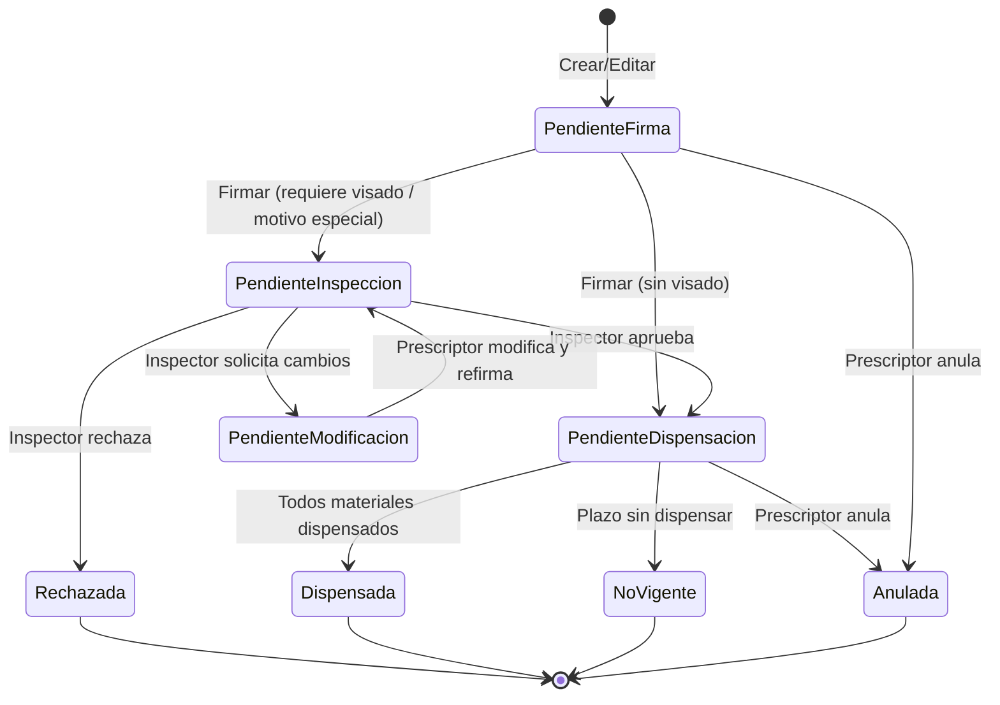
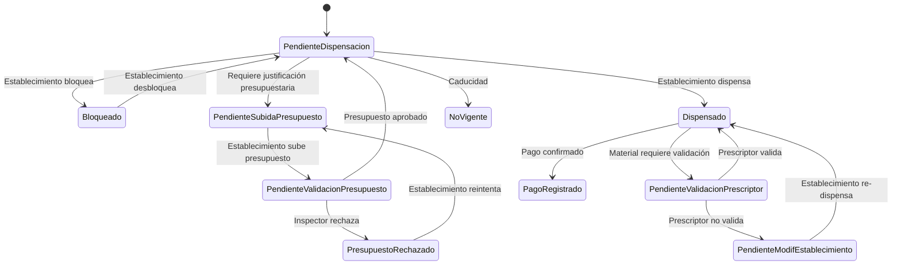
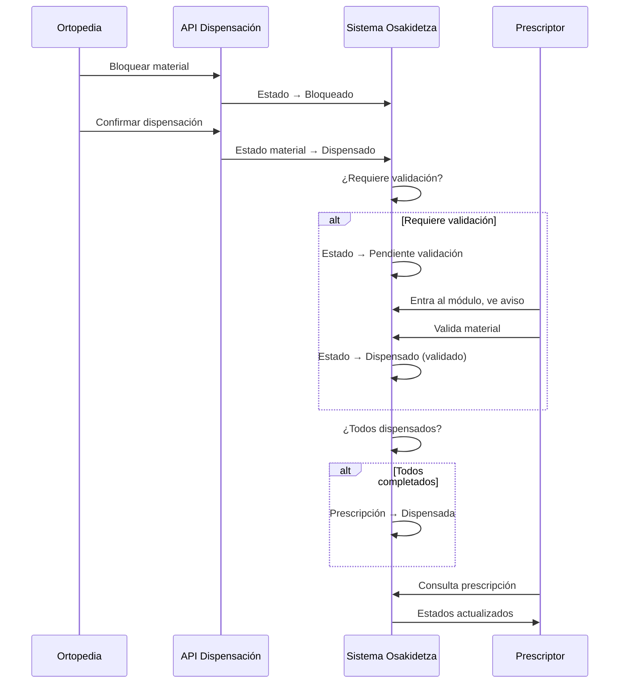
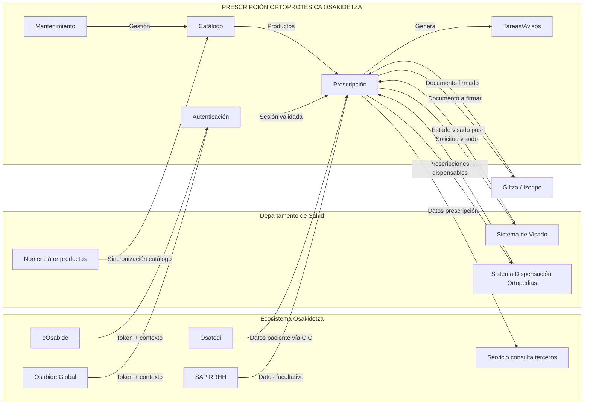

# Proyecto Prescripciones Ortoprotésicas — Osakidetza

## Enfoque PM/BA V5

Fecha: 05/03/2026
Estado: **Borrador V5** — alcance acotado a Osakidetza

---

## 1. Alcance

### 1.1 Incluido

Sistema para que los profesionales de Osakidetza prescriban, gestionen y hagan seguimiento de prescripciones ortoprotésicas.

- **Prescripción completa**: crear, editar, eliminar, copiar, anular, renovar, firmar, imprimir, descargar informe, exportar Excel.
- **Listado y búsqueda de prescripciones**: por facultativo, por paciente, con filtros avanzados.
- **Detalle de prescripción**: datos de facultativo, paciente, materiales, estados, histórico.
- **Catálogo de productos**: BBDD propia en Osakidetza (réplica del nomenclátor del Departamento + campos propios), búsqueda ágil, favoritos por facultativo.
- **Mantenimiento**: gestión de catálogo, establecimientos, configuración del sistema.
- **Tareas pendientes y avisos**: visibles al entrar al módulo (fuera de Osabide Global), pendientes de modificación, visados, dispensaciones.
- **Interoperabilidad**: APIs de dispensación (consulta, bloqueo, desbloqueo, recepción), recepción de estado de visado (push), servicio de consulta para sistemas terceros.
- **Cierre del ciclo asistencial**: recepción del dato de dispensación, actualización automática de estados, visibilidad para el prescriptor.
- **Doble acceso**: vía Osabide Global (con o sin paciente) y login externo directo.
- **Transversales**: multi-idioma (euskera/castellano), QA.
- **Persistencia propia**: BBDD del módulo. Otros sistemas de Osakidetza que necesiten datos de prescripciones los obtendrán mediante un servicio que este desarrollo debe incluir.

### 1.2 Excluido

| Excluido | Motivo |
|---|---|
| Pantallas de visado/inspección | Competencia del Departamento |
| Reintegro de gastos, abono directo, multiterceros | Competencia del Departamento |
| Pantallas de dispensación para ortopedias | Las ortopedias usan su propio sistema; exponemos APIs |
| Chat prescriptor-establecimiento | Fuera de alcance |
| Reporting / ETL a plataforma analítica | Eliminado del alcance |
| Desarrollo de APIs del Departamento de visado | Proyecto separado; el Departamento provee las APIs |

---

## 2. Modelo de acceso

### 2.1 Acceso vía Osabide Global (principal)

El facultativo accede desde Osabide Global mediante token de sesión con contexto: profesional, centro, ámbito, servicio.

Dos modos de uso:
- **Con paciente**: el facultativo está en la cita del paciente. Entra con los datos del paciente ya cargados (CIC) y ve las prescripciones de ese paciente.
- **Sin paciente**: el facultativo ha terminado la cita y quiere ver todas sus prescripciones como profesional. Puede trabajar en todo lo que tiene abierto él.

El sistema debe admitir ambos modos: acceso con paciente asociado y sin él.

### 2.2 Acceso externo directo (secundario)

URL web directa con login LDAP/AD corporativo. Para pruebas, perfiles no-Osabide o situaciones excepcionales.

---

## 3. Módulos del sistema

### MÓDULO 1 — AUTENTICACIÓN Y AUTORIZACIÓN

| Funcionalidad | Descripción |
|---|---|
| Login desde Osabide Global | Recepción de token, validación de contexto profesional, carga de permisos. Osabide Global proporciona datos del facultativo relativos a su estructura organizativa |
| Login externo | Pantalla de login con credenciales LDAP/AD |
| Gestión de roles | Pendiente definir (ver pregunta abierta P-01) |
| Cambio de rol en sesión | Si un usuario tiene varios roles, puede cambiar de rol activo |
| Modo con/sin paciente | Admitir acceso con paciente asociado (cita activa) y sin paciente (gestión propia del facultativo) |

> **Pendiente**: No está claro de dónde vienen los permisos ni qué dato determina lo que cada facultativo puede prescribir. Un mismo médico puede trabajar en dos hospitales con roles distintos en cada uno. Puede que el contexto de Osabide Global sea suficiente o puede que haya que crear un módulo de gestión de roles propio (P-01).

---

### MÓDULO 2 — CATÁLOGO / NOMENCLÁTOR DE PRODUCTOS

Osakidetza siempre trabaja contra su propia copia de la base de datos. No se consulta directamente al Departamento.

| Funcionalidad | Descripción |
|---|---|
| BBDD propia del catálogo | Modelo de datos con campos del nomenclátor del Departamento + campos propios de Osakidetza. Se trae la base de datos del Departamento y se crea una BBDD que contenga lo que Osakidetza necesite |
| Carga masiva (batch) | Proceso periódico de sincronización desde el nomenclátor del Departamento (~1.000 productos) |
| Carga bajo demanda | Ejecución manual del mismo proceso fuera de ciclo |
| Pantalla de gestión catálogo | Listado con filtros + ficha de producto editable (campos Osakidetza) + activar/desactivar. Osakidetza puede decidir no recetar un producto que venga del Departamento |
| Búsqueda ágil de productos | Filtros por tipo, familia (grupo > subgrupo > categoría), código, descripción. Accesible desde la prescripción |
| Selección de productos | Pantalla de selección dentro de prescripción: favoritos primero + productos similares. Aunque el facultativo no tenga permisos para un producto, debe ver el catálogo completo (productos sin permiso aparecen como no disponibles para que pueda solicitar permisos si es un error) |
| Gestión de favoritos | El favorito es un dato por facultativo que se almacena en la BBDD de Osakidetza. Lo marca el propio facultativo desde la prescripción |
| Gobierno de edición | Se traen los datos del Departamento, se crean tablas propias de Osakidetza, y se añade la información necesaria para la gestión de la prescripción |

> **Esquema de datos del catálogo**: Datos del Departamento (código, descripción, familia, tipo, requiere visado, protocolo, precio) + Datos de Osakidetza (activo sí/no, favorito por facultativo, campos propios pendientes de definir).

---

### MÓDULO 3 — PRESCRIPCIÓN ORTOPROTÉSICA (núcleo)

#### 3.1 Pantalla de listado de prescripciones

Antes de entrar al listado, la pantalla debe mostrar si hay algo pendiente (avisos).

Listado de prescripciones vinculadas al paciente (si hay paciente en contexto) o al facultativo (si accede sin paciente).

**Filtros**:

| Filtro | Tipo |
|---|---|
| Por facultativo (mis prescripciones / todas) | Selector |
| Por paciente (TIS/CIP, nombre) | Búsqueda |
| Por estado de prescripción | Desplegable multi-selección |
| Por fecha (desde/hasta) | Rango de fechas |
| Por OSI / Localización | Desplegable |
| Por tratamiento / tipo producto | Desplegable |

**Acciones desde el listado**:

| Acción | Descripción |
|---|---|
| Crear (Añadir) | Abre formulario de nueva prescripción |
| Editar | Abre prescripción existente (si el estado lo permite) |
| Copiar (Duplicar) | Clona prescripción como nueva; elimina materiales no válidos para la especialidad del prescriptor |
| Eliminar | Elimina prescripción en borrador/pendiente de firma |
| Anular | Anula la prescripción (si no dispensada ni anulada) |
| Renovar | Crea prescripción de renovación; si es temprana, exige justificación clínica |
| Descargar informe | Genera y descarga informe/CSV de la prescripción firmada |
| Imprimir prescripción | Genera PDF oficial para entrega al paciente |
| Generar Excel | Exporta listado filtrado a Excel |
| Consultar detalle | Accede a la ficha completa de la prescripción |

**Indicador visual de estado de dispensación**: el listado debe incluir un icono, color o columna de estado que permita al facultativo identificar visualmente el estado de dispensación sin tener que entrar al detalle.

#### 3.2 Pantalla de creación/edición de prescripción

**Bloque Datos del paciente** (precargados):
- Nombre, apellidos, TIS/CIP, sexo, fecha nacimiento, domicilio.
- Precargados automáticamente mediante servicio web de Osategi a partir del CIC del paciente. En Osakidetza, a diferencia de Aragón, el facultativo ya entra con los datos del paciente; no los busca manualmente.

**Bloque Datos del facultativo** (precargados):
- Nombre, apellidos, nº colegiado, especialidad, centro, servicio.
- Precargados desde el contexto de Osabide Global o, en acceso directo, desde el directorio corporativo.

**Bloque Datos de la prescripción**:
- Nº Expediente (pendiente definir si se genera en Osakidetza y contra qué sistema — ver P-02)
- Diagnóstico y justificación anatómico-funcional (texto libre, obligatorio)
- Motivo de prescripción (enfermedad común, accidente no laboral, accidente trabajo, enfermedad profesional)
- Observaciones (texto libre, opcional)
- Justificación de renovación (obligatorio si renovación temprana)

**Tabla de materiales prescritos**:
- Cada fila: Código producto, Descripción, Renovación (sí/no), Requiere visado, Protocolo, Estado material.
- **Buscador de productos**: el médico busca por código, material, familia. El sistema valida si tiene capacidad de prescribirlo. El producto muestra si requiere visado, protocolo, etc.
- Si requiere visado → obligar adjuntar informe clínico.
- Si tiene protocolo → mostrar campos adicionales del protocolo.
- Cada prescriptor solo puede prescribir productos de su unidad clínica; el administrador puede prescribir todo (sujeto a resolución de P-01 sobre permisos).

**Acciones del formulario**:
- Guardar (borrador)
- Guardar y firmar → firma digital (Giltza/Izenpe) → genera CSV/documento firmado
- Descargar CSV (una vez firmada)

#### 3.3 Pantalla de detalle/consulta de prescripción

Vista en modo lectura con todos los datos. Incluye:
- Histórico de la prescripción (acciones realizadas, cambios de estado, fechas)
- Documentos adjuntos (informe clínico, CSV firmado)
- Estado actual de cada material individual

#### 3.4 Estados de la prescripción

| Estado | Descripción | Transiciones posibles |
|---|---|---|
| Pendiente de firma | Creada/editada, pendiente de firmar | → Pendiente inspección / Pendiente dispensación / Anulada |
| Pendiente inspección | Firmada; contiene material que requiere visado, renovación temprana, protocolo, o motivo especial | → Rechazada / Pendiente modificación / Pendiente dispensación |
| Rechazada | Rechazada por inspección; no se puede reabrir | Estado terminal |
| Pendiente modificación | Inspector solicita cambios al prescriptor | → Pendiente inspección (al refirmar) |
| Pendiente de dispensación | Válida para dispensar | → Dispensada / No vigente / Anulada |
| Dispensada | Todos los materiales dispensados | Estado terminal |
| No vigente | No dispensada en plazo configurado (caducidad automática) | Estado terminal |
| Anulada | Cancelada por el prescriptor | Estado terminal |

> **Pregunta abierta (P-03)**: Si una prescripción tiene 4 productos y uno no está dispensado, ¿la prescripción se considera no dispensada? Es lógico mantener dos niveles de estado (prescripción y material), pero hay que definir la regla de transición exacta.

#### 3.5 Estados de los materiales

Una prescripción puede contener varios productos y cada uno puede estar en un estado distinto (por ejemplo, uno requiere visado y tres no). El estado es por material, no solo por prescripción.

| Estado material | Descripción |
|---|---|
| Pendiente de dispensación | Listo para ser dispensado |
| Bloqueado | Reservado por un establecimiento; ningún otro puede dispensarlo |
| Dispensado | El establecimiento ha confirmado la dispensación. Queda bloqueado para que no pueda volver a dispensarse |
| Pendiente validación prescriptor | Dispensado pero requiere validación clínica del prescriptor (plazo configurable) |
| Pendiente modificación establecimiento | El prescriptor no validó; la ortopedia debe ajustar |
| Pago registrado | Se ha registrado el pago/abono |
| No vigente | Material caducado por no dispensarse en plazo |
| Pendiente subida presupuesto | Requiere justificación presupuestaria por parte del establecimiento |
| Pendiente validación presupuesto | Presupuesto subido; pendiente de aprobación por inspección |
| Presupuesto rechazado | Presupuesto rechazado; el establecimiento debe volver a subirlo |

La dispensación puede ser parcial: la ortopedia puede dispensar solo parte de los materiales de una prescripción. El prescriptor verá el estado material a material.

#### 3.6 Diagrama de estados de prescripción

#### 3.7 Diagrama de estados de material

#### 3.8 Verificación contra la Prescripción Modelo de Aragón

El PDF de prescripción real de Aragón (GELPO) contiene estos bloques, todos cubiertos:

| Bloque del PDF modelo | Dónde se cubre |
|---|---|
| Cabecera institucional, Nº Expediente | §3.2 — plantilla PDF de Osakidetza (pendiente definir) |
| Datos del paciente | §3.2 — precargados desde Osategi vía CIC |
| Datos del facultativo | §3.2 — precargados desde Osabide Global |
| Motivo de prescripción | §3.2 — 4 opciones |
| Diagnóstico y justificación | §3.2 — campo obligatorio |
| Tabla de materiales | §3.2 — tabla de materiales prescritos |
| Observaciones clínicas | §3.2 — campo opcional |
| Firma digital con CSV | §3.2 — integración Giltza/Izenpe |
| Fecha y hora de emisión | Implícito en la firma digital |
| PDF imprimible | §3.1 — acción Imprimir prescripción |

**Pendiente**: Definir con Osakidetza la plantilla PDF oficial (logotipo, formato, disposición de campos, texto legal).

#### 3.9 Flujo de cierre del ciclo asistencial

Cadena completa desde que la ortopedia dispensa hasta que el médico ve la entrega confirmada.

| Paso | Actor | Acción | Resultado |
|---|---|---|---|
| 1 | Ortopedia | Bloquea material vía API | Estado material → Bloqueado |
| 2 | Ortopedia | Dispensa material vía API | Estado material → Dispensado (queda bloqueado para no volver a dispensarse) |
| 3 | Sistema | Evalúa si requiere validación clínica | Si requiere → Pendiente validación prescriptor |
| 4 | Sistema | Genera aviso para el prescriptor | Visible al entrar al módulo |
| 5 | Prescriptor | Valida o rechaza | Si valida → Dispensado; si rechaza → Pendiente modificación establecimiento |
| 6 | Sistema | Todos los materiales dispensados | Estado prescripción → Dispensada |
| 7 | Prescriptor | Consulta prescripción | Ve estados actualizados con indicador visual |

**Datos que retornan de la dispensación**: los que proporcione el Departamento. Se registra fecha, establecimiento y dato de dispensación. No se registra el profesional individual de la ortopedia, solo el establecimiento.

**Visibilidad para el prescriptor**:
- **Listado**: icono/color + columna de estado textual para identificar visualmente el estado de dispensación sin entrar al detalle.
- **Detalle**: estado de cada material individual con fecha y establecimiento.
- **Avisos**: alerta al entrar al módulo si hay materiales pendientes de validación.
- **Notificación pasiva**: el prescriptor ve el estado al entrar al módulo, no recibe push externo.

---

### MÓDULO 4 — TAREAS PENDIENTES Y AVISOS

Las tareas pendientes se visualizan al entrar al módulo de prescripciones, fuera de Osabide Global.

| Funcionalidad | Descripción |
|---|---|
| Aviso al entrar | Al acceder al módulo, mostrar si hay algo pendiente antes de entrar al listado |
| Tarea por solicitud de visado | Al pasar a "Pendiente inspección", se genera tarea de seguimiento |
| Tarea por cambio de estado de visado | Al cambiar estado (aprobado/rechazado/solicitud modificación), se crea/actualiza tarea |
| Tarea por validación pendiente | Si material dispensado requiere validación del prescriptor |
| Tarea por dispensación completada | Cuando todos los materiales se dispensan, aviso de cierre de ciclo |
| Pantalla de tareas pendientes | Interfaz donde el facultativo ve: visados pendientes, rechazados, modificaciones solicitadas, dispensaciones pendientes de validación |

> **Pregunta abierta (P-04)**: ¿Dónde exactamente se visualizan los avisos? ¿Pantalla propia del módulo? ¿Barra de notificaciones?

---

### MÓDULO 5 — MANTENIMIENTO Y ADMINISTRACIÓN

| Funcionalidad | Descripción |
|---|---|
| Gestión de catálogo | Listado, edición de campos propios Osakidetza, activar/desactivar productos |
| Gestión de establecimientos | Tener el dato de qué establecimiento dispensó, a qué precio y quién. Mantener el listado de establecimientos |
| Configuraciones del sistema | Parámetros operativos (plazos de caducidad, configuraciones de sincronización) |

---

### MÓDULO TRANSVERSAL

| Funcionalidad | Descripción |
|---|---|
| Multi-idioma | Euskera / castellano en front y back |
| Unificación de pacientes | Modificar proceso existente de Osakidetza para incluir prescripciones ortoprotésicas |
| QA y pruebas | Plan de pruebas + tests unitarios |
| Servicio de consulta para terceros | API/servicio para que otros sistemas de Osakidetza consulten datos de prescripciones. El número de consumidores no se conoce aún |

---

## 4. Dependencias de sistemas

### 4.1 Mapa de dependencias

### 4.2 Tabla de dependencias

| ID | Sistema externo | Dirección | Datos | Tipo integración | Criticidad |
|---|---|---|---|---|---|
| DEP-01 | Osabide Global | → Sistema | Token sesión, contexto profesional (estructura organizativa facultativo), paciente | Token en llamada de apertura | Crítica |
| DEP-02 | eOsabide / Osabide Integra | → Sistema | Token sesión, contexto profesional | Token en llamada de apertura | Alta |
| DEP-03 | Osategi | → Sistema | Datos paciente (TIS, CIP, nombre, sexo, nacimiento, domicilio) vía CIC | Servicio web | Crítica |
| DEP-04 | SAP RRHH | → Sistema | Datos facultativo (nº colegiado, especialidad, centro, servicio) | API / BBDD | Crítica |
| DEP-05 | Nomenclátor del Departamento | → Sistema | Catálogo completo con familias, flags visado, precios | Sincronización batch + réplica local | Crítica |
| DEP-06 | Giltza / Izenpe | ↔ Sistema | Documento a firmar / documento firmado + CSV | Servicio de firma digital | Crítica |
| DEP-07 | Sistema de Visado (Depto.) | ↔ Sistema | Solicitud visado / Estado visado (push inmediato) | API evento (Osakidetza crea el servicio receptor; las APIs del Dpto. son un proyecto separado) | Crítica |
| DEP-08 | Sistema Dispensación (Ortopedias) | ↔ Sistema | Consulta prescripciones dispensables / bloqueo / desbloqueo / dispensación. Datos del Departamento | API interoperabilidad | Alta |
| DEP-09 | Servicio consulta terceros | Sistema → | Datos de prescripciones para otros sistemas Osakidetza | API interna | Media |

### 4.3 Impacto de cada dependencia

| Dependencia | Sin ella el sistema... |
|---|---|
| DEP-01 (Osabide Global) | No puede abrir prescripciones desde el entorno clínico habitual |
| DEP-03 (Osategi) | No puede precargar datos del paciente |
| DEP-04 (SAP RRHH) | No puede identificar al facultativo ni validar su especialidad |
| DEP-05 (Nomenclátor) | No tiene catálogo de productos: imposible prescribir |
| DEP-06 (Giltza) | No puede firmar prescripciones: se quedan en borrador permanente |
| DEP-07 (Visado) | Las prescripciones que requieren visado se quedan bloqueadas indefinidamente |
| DEP-08 (Dispensación) | No se puede cerrar el ciclo asistencial |

---

## 5. Reglas de negocio

| # | Regla |
|---|---|
| RN-01 | Cada prescriptor solo puede prescribir productos de su unidad clínica / especialidad (sujeto a resolución de P-01) |
| RN-02 | Si un producto requiere visado, el informe clínico adjunto es obligatorio para firmar |
| RN-03 | Una prescripción puede contener varios productos; cada producto puede dispensarse en un establecimiento distinto |
| RN-04 | Si el motivo es accidente de trabajo o enfermedad profesional, se requiere intervención adicional |
| RN-05 | Prescripción rechazada por inspección: no se puede reabrir; se debe crear nueva |
| RN-06 | Inspector puede solicitar modificación → prescriptor recibe aviso → modifica y refirma → vuelve a revisión |
| RN-07 | Renovación temprana: si la fecha de renovación no ha vencido, se exige justificación clínica escrita |
| RN-08 | Una vez dispensado el material, queda bloqueado. No se puede volver a dispensar |
| RN-09 | Establecimiento puede bloquear un material para impedir dispensación por otros; solo él puede desbloquearlo |
| RN-10 | Prescripción no dispensada en plazo caduca automáticamente. Plazo configurable (propuesta inicial: 6 meses) |
| RN-11 | El PDF de prescripción debe poder imprimirse siempre para que el paciente lo entregue en la ortopedia |
| RN-12 | El nomenclátor indica qué productos requieren visado |
| RN-13 | El catálogo muestra todos los productos al facultativo, incluso los que no puede prescribir (aparecen como no disponibles), para que pueda solicitar permisos si hay un error |
| RN-14 | Cuando todos los materiales de una prescripción están dispensados, la prescripción pasa automáticamente a estado Dispensada (terminal). Regla exacta de transición pendiente de definir (P-03) |
| RN-15 | Datos del paciente se precargan automáticamente desde Osategi vía CIC; no se buscan manualmente como en Aragón |
| RN-16 | La dispensación puede ser parcial: la ortopedia puede dispensar solo parte de los materiales |
| RN-17 | Persistencia propia: BBDD del módulo. Otros sistemas consultan mediante servicio expuesto por este desarrollo |

---

## 6. Verificación cruzada con el Excel de estimación

### 6.1 Necesidades del contexto sin tarea en el Excel

| Necesidad | Observación |
|---|---|
| Pantalla inicio con avisos/dashboard | Falta tarea específica |
| Cambio de rol en sesión | Falta tarea front + back |
| Réplica operativa 24x7 del nomenclátor en Osakidetza | Falta tarea de sincronización y failover |
| Gobierno de edición de campos Osakidetza | Falta definición + desarrollo de la BBDD con campos propios |
| Gestión de establecimientos | Falta pantalla y APIs |
| Eliminar prescripción | Hay API back pero falta acción en front |
| Histórico de la prescripción | Falta tarea de auditoría/histórico |
| Regla: prescriptor solo prescribe productos de su unidad | Falta validación back |
| Regla: motivo accidente/enf. profesional | Falta comunicación al sistema de visado |
| Regla: prescripción rechazada no se puede reabrir | Falta validación back |
| Tarea por validación post-dispensación | Falta tarea/aviso |
| Proceso automático de caducidad | Falta job/proceso |
| Servicio de consulta para terceros | Falta API interna |
| Unificación de pacientes | Solo en hoja separada |

### 6.2 Tareas del Excel a revisar

| Tarea | Observación |
|---|---|
| T-001/T-002: Multi-idioma (120h) | ¿El framework ya lo soporta? |
| T-003: API configuraciones (40h) | Mezcla configuraciones + roles; separar |
| T-009/T-010: Carga masiva/on-demand (60h) | Falta réplica/failover |
| T-027/T-028: Info facultativo/paciente (80h) | No especifica si es API, BBDD directa o ambas |
| T-032: Firmar prescripción front (10h) | Posiblemente subestimado para integración Giltza |
| T-040: Firmar prescripción back (40h) | ¿Redundante con T-032? Parece par front/back |
| T-045: Prescripción recurrente (20h) | ¿Es "Renovar"? Puede ser insuficiente si incluye justificación |
| T-050 a T-053: APIs dispensación | Falta definición del contrato API |
| T-054: Recibir info visado (60h) | No diferencia solicitud (ida) de recepción (vuelta); deberían ser 2 tareas |
| T-056/T-057: QA (240h) | ~10% del desarrollo; con la complejidad de estados podría quedarse corto |

---

## 7. Riesgos

| # | Riesgo | Impacto | Mitigación |
|---|---|---|---|
| R1 | Roles y permisos del facultativo sin definir | No se puede validar quién prescribe qué | Taller con Osakidetza para definir modelo de permisos |
| R2 | Especificación de Giltza no disponible | Flujo de firma imposible | Solicitar documentación API |
| R3 | Contrato API de dispensación sin definir | No se cierra ciclo asistencial | Documentar contrato con Departamento |
| R4 | Modelo prescripción/receta/producto sin decisión | Diseño BBDD erróneo | Decisión funcional antes de sprint BBDD |
| R5 | APIs de visado del Departamento pueden no existir aún | Prescripciones con visado bloqueadas | Coordinar con Departamento; preparar servicio receptor |
| R6 | Excel de estimación incompleto (14 necesidades + 12 revisiones) | Desviación de alcance y esfuerzo | Contrastar con este documento |
| R7 | Complejidad de máquina de estados | Bugs en producción | Definir máquina de estados formal + pruebas exhaustivas |
| R8 | Dato de eOsabide no claro | Posible duplicidad o carencia de datos del facultativo | Aclarar qué datos proporciona exactamente |

---

## 8. Preguntas abiertas

| ID | Pregunta |
|---|---|
| P-01 | **Roles y permisos del facultativo**: ¿De dónde vienen? ¿Qué dato determina lo que cada facultativo puede prescribir? Un mismo médico puede trabajar en hospital A con unos permisos y en hospital B con otros. ¿Basta con la información de contexto de Osabide Global o hay que crear un módulo de gestión de roles propio? |
| P-02 | **Nº de expediente**: ¿Se genera en Osakidetza? ¿De dónde viene o contra qué sistema se genera? |
| P-03 | **Regla de transición de estado de prescripción**: Si una prescripción tiene varios materiales y uno no está dispensado, ¿la prescripción se considera no dispensada? Definir la regla exacta de transición prescripción ↔ materiales |
| P-04 | **Ubicación de avisos**: ¿Dónde exactamente se visualizan las tareas pendientes y avisos dentro del módulo? |
| P-05 | **Dato de eOsabide**: ¿Qué dato proporciona exactamente eOsabide además de Osabide Global? ¿Es redundante? |
| P-06 | **Reversión de dispensación**: ¿Aplica la posibilidad de revertir una dispensación en las primeras 72 horas? |
| P-07 | **Contrato API de dispensación**: ¿Qué datos exactos devuelve la ortopedia al confirmar la dispensación? Se espera que sean los que proporcione el Departamento, pero hay que definirlos |
| P-08 | **Dispensación parcial — regla de visualización**: La dispensación puede ser parcial. ¿Cómo se visualiza al prescriptor el estado material a material? Definir UX |

---

## 9. Siguiente paso

1. Resolver las **8 preguntas abiertas** (P-01 a P-08).
2. Ajustar el Excel de tareas con las necesidades no cubiertas y las revisiones identificadas.
3. Generar épicas por módulo con criterios de aceptación.
4. Desglosar en tareas por equipo (frontend, backend, integración, QA).
5. Definir secuencia de desarrollo basada en dependencias.
